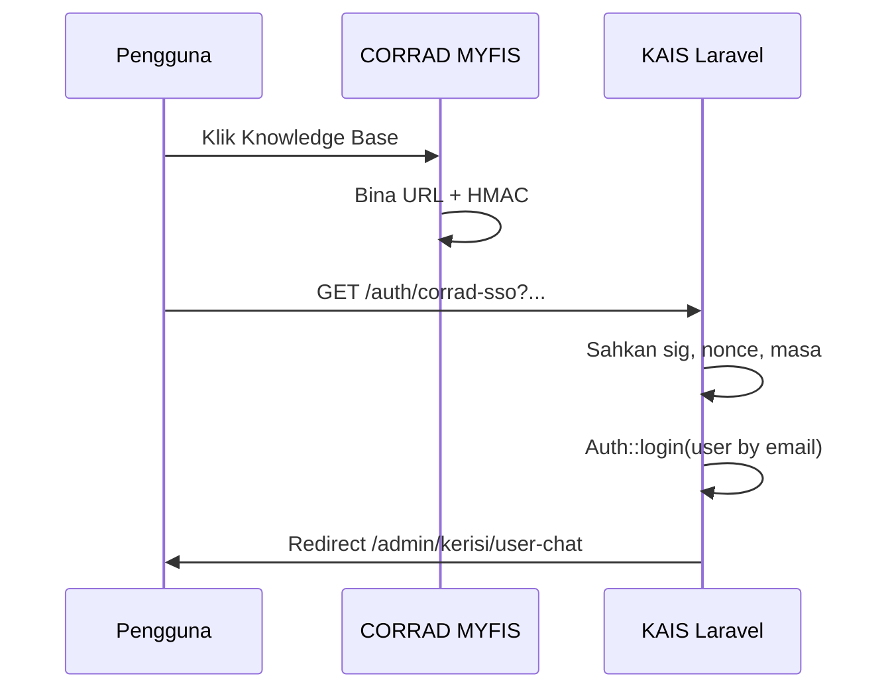

# Integrasi CORRAD (MYFIS) ↔ KAIS — Knowledge Base / User Chat (full page + SSO)

Repo **corrad-laravel** ini ialah **KAIS** (Laravel + Vue). Kod **framework CORRAD** (PHP vanilla MYFIS) **tidak** disimpan dalam repo ini — anda tambah ikon & panggilan SSO **di dalam folder projek CORRAD** sendiri, mengikut snippet di bawah.

## Apa yang anda mahu

1. Ikon **Knowledge Base** di header CORRAD, **sebelah menu 3 titik** (kanan).
2. Klik → buka **User Chat KAIS** sebagai **halaman penuh** (bukan iframe).
3. **“Share session”** dalam erti teknikal: dua aplikasi berbeza domain tidak boleh kongsi `PHP $_SESSION` yang sama. Penyelesaian yang disokong di sini ialah **SSO bercap tangan (HMAC)** — CORRAD bina URL berpecah masa; KAIS sahkan tandatangan, log masuk pengguna Laravel, kemudian redirect ke `/admin/kerisi/user-chat`.

## Prasyarat KAIS (Laravel)

1. Dalam `.env` KAIS:

```env
CORRAD_SSO_SECRET=gunakan-nilai-rawak-panjang-sama-di-corrad
CORRAD_SSO_MAX_AGE_SECONDS=120
```

2. Dalam KAIS, **wujudkan pengguna** dengan **e-mel sama** seperti pengguna CORRAD (`users.email`), aktif (`is_active = 1`), dan peranan/kebenaran **`chat.use`** (dan apa-apa menu lain yang diperlukan).

3. `php artisan config:clear`

4. Endpoint SSO (sedia ada dalam repo ini):

`GET /auth/corrad-sso?email=...&ts=...&nonce=...&sig=...&redirect=/admin/kerisi/user-chat`

- `sig` = `hash_hmac('sha256', email|ts|nonce, CORRAD_SSO_SECRET)`  
- `email` = huruf kecil, trim  
- `nonce` = sekali guna (anti-replay)

Jika `CORRAD_SSO_SECRET` kosong, laluan ini memulangkan **404** (fitur dimatikan).

## Fail helper di CORRAD

1. Salin fail **[docs/snippets/corrad-kais-sso.php](snippets/corrad-kais-sso.php)** ke projek CORRAD (contoh `includes/kais_sso.php`).

2. Dalam bootstrap / header CORRAD, **require_once** fail tersebut **sekali**.

3. Tetapkan pembolehubah persekitaran CORRAD (atau fail config yang tidak di-commit):

```env
KAIS_BASE_URL=https://url-kais-anda
CORRAD_KAIS_SSO_SECRET=sama_dengan_CORRAD_SSO_SECRET_di_Laravel
```

## Letak ikon di header (sebelah 3 titik)

Cari template header CORRAD yang render bar atas / menu ⋮ (nama fail bergantung projek: `header.php`, `top_nav.php`, `main_layout`, dsb.).

**Contoh HTML+PHP** (sesuaikan kelas CSS dengan tema CORRAD anda):

```php
<?php
// Pastikan fungsi kais_fullpage_user_chat_url() telah di-load
$kaisKbUrl = kais_fullpage_user_chat_url(
    $_SESSION['user_email'] ?? '',  // sesuaikan dengan pembolehubah sesi CORRAD anda
    $_SESSION['user_name'] ?? ''
);
?>
<a
  href="<?php echo htmlspecialchars($kaisKbUrl, ENT_QUOTES, 'UTF-8'); ?>"
  class="your-header-icon-btn"
  title="Knowledge Base — KAIS User Chat"
  style="display:inline-flex;align-items:center;justify-content:center;width:40px;height:40px;margin-right:8px;border-radius:8px;color:#0f766e;text-decoration:none;"
>
  <!-- ikon buku / chat -->
  <svg xmlns="http://www.w3.org/2000/svg" width="22" height="22" viewBox="0 0 24 24" fill="none" stroke="currentColor" stroke-width="2">
    <path d="M4 19.5A2.5 2.5 0 0 1 6.5 17H20"/>
    <path d="M6.5 2H20v20H6.5A2.5 2.5 0 0 1 4 19.5v-15A2.5 2.5 0 0 1 6.5 2z"/>
  </svg>
</a>
```

Letak blok ini **sebelum** elemen menu 3-titik supaya ia muncul di sebelah kiri ⋮.

**Penting:** Ganti `$_SESSION['user_email']` dengan cara CORRAD anda simpan e-mel pengguna log masuk (contoh `$GLOBALS['USER']['EMAIL']`, `$_SESSION['PRUSER']['EMAIL']`, dll.).

## Aliran keseluruhan



## Keselamatan

- Gunakan **HTTPS** sahaja di production.
- **Secret** sama panjang & rawak; jangan commit ke git awam.
- Pengguna KAIS **tidak** dicipta automatik — elak akaun tidak dikawal.

## Ujian automatik (KAIS)

```bash
composer test
```

Fail: `tests/Feature/CorradSsoTest.php`

## Jika anda mahu hantar folder CORRAD

Buka folder CORRAD sebagai workspace / tambah submodul dalam Cursor, kemudian minta semakan pada fail header sebenar — barulah kami boleh tunjuk **baris tepat** untuk tampal snippet.

---

*Lihat juga: [kerisi-myfis-user-chat-embed.md](kerisi-myfis-user-chat-embed.md) untuk FAB / iframe tanpa SSO.*
